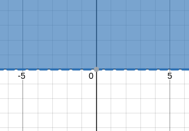

**Theory of functions of a complex variable**

Laboratory work №2

**Task description**

D: 


D':


**analytical description of areas:**

D: |z| < e

D': |w - 2| < 2 ; 0 < arg(w) < pi / 2

**conformal mapping:**

first transition:


-> v = 1j * ln(z / e)



implementation:

```python
import numpy as np
from math import e

def first_transition(z: np.ndarray) -> np.ndarray:
    v = 1j * (np.log(np.abs(z / e)) + 1j * np.angle(z / e))
    return v
```

second transition:


-> g = |v| * e ^ (arg(v) * i / 2)


implementation:

```python
import numpy as np

def second_transition(v: np.ndarray) -> np.ndarray:
    arg_v = np.angle(v)
    mod_v = np.abs(v)
    g = mod_v * np.exp(1j * arg_v / 2)
    return g
```

third transition:


-> i * g / pi + 1


implementation:

```python
import numpy as np

def third_transition(g: np.ndarray) -> np.ndarray:
    h = 1j * g / np.pi + 1
    return h
```

fourth transition:


-> h' = -2 / h / 10


implementation:

```python
import numpy as np

def fourth_transition(h: np.ndarray) -> np.ndarray:
    h1 = -2 / h / 10
    return h1
```

fifth transition:


-> h'' =  |h'| * e ^ ((arg(h') - pi/2) * i)


implementation:

```python
import numpy as np

def fifth_transition(h1: np.ndarray) -> np.ndarray:
    arg_h = np.angle(h1)
    mod_h = np.abs(h1)
    h2 = mod_h * np.exp(1j * (arg_h - np.pi / 2))
    return h2
```

**Result animation:**

